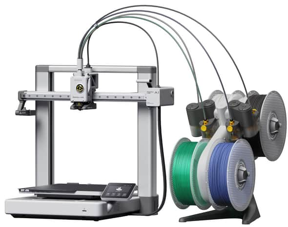

# 3D-skrivere

Les gjennom hele dette dokumentet før du skriver ut noe for første gang, selv om du har brukt 3D-skrivere før. Si fra om du synes det er noe som mangler. Det er ofte flere som lurer på det samme som deg!

Om du ikke har brukt en 3D-skriver, få hjelp av noen som kan eller kom på et introduksjonskurs. Alle Tromsøskapere har lyst til å hjelpe og dele informasjon.

Fornuftige folk å kontakte med via e-post er [Kenneth](kenneth@tromsoskapere.no), [Snorre](mailto:snorre@tromsoskapere.no), [Alf](mailto:alf@tromsoskapere.no) og [Torbjørn](mailto:torbjorn@tromsoskapere.no). Du kan også snakke med folk direkte på Discord.

### Sikkerhet og hensyn til andre

- 3D-utskrift smelter plast, så her kan det fort bli varmt!
- Utskriftsplaten og føringskablene for plast er dekt med helseskadelige fluorkarboner. Vask hendene etter berøring.
- Vær aller helst tilstede under utskrift og ta med deg utskriften når du er ferdig.
- Pass på at skriveren har tilstrekkelig plass rundt seg for å skrive ut uten å sette seg fast.
- Fjern plastrester og rens utskriftsplaten med sprit  før og etter utskrift. Blårens finnes på kjøkkenet. Ikke bruk metall på utskriftsplaten.
- Plastruller som ikke er i bruk skal ligge i plastpose med en liten "tørkepose" i papir. Plast som ligger fritt suger til seg fuktighet og blir ødelagt.
- Rydd opp når du er ferdig. Forlat rommet i litt bedre tilstand enn du fant det.

## Bambu Labs A1 med AMS

Bambu Lab A1 er en nybegynnervennlig 3D-skriver med helautomatisk kalibrering og mulighet for flerfargeutskrift via AMS-tilbehøret.

### Bruk

Bruk [Bambu Studio](https://bambulab.com/en-eu/download/studio) for å skrive ut til 3D-printeren.

IP-adressen til skriveren er **10.8.0.20** og tilgangskoden du trenger for tilgang er **32481046**.

Skriveren er delt til alle på nettverket via LAN Only-modus. Du kan ikke knytte skriveren til din appen på din egen smarttelefon, så fjernstyring eller -overvåking av skriveren via internett støttes ikke for nå.

Vi jobber med en løsning for å forbedre dette.

### Pris

Det er gratis å bruke printeren. Du betaler kun for plasten du bruker under utskriving.

Du skal betale for *all* plast som brukes av printeren, inkludert prototyper, feilutskrifter, støtteplast og "printerbæsj" som printeren spytter ut når den starter eller bytter farge.

**Prisen er 50 øre per gram plast, uansett hvilken type. Vipps til 944927 når du er ferdig.**

Legg med en kort beskrivelse av hva betalingen gjelder.

Vi skal sette opp en kjøkkenvekt og en fangstboks for printerbæsj slik at det blir enkelt å finne ut nøyaktig hvor mye du har brukt. Inntil videre må du bruke funksjonen i Bambu Studio som sier hvor mange gram som blir brukt pluss skjønn for printerbæsj og annet svinn.

### Plast

Det ligger flere ruller med plast på rommet. Noen av disse er på gjenbruksruller som skal monteres inn i en grå plasttrommel før de kan settes på skriveren.

Du kan ikke montere en gjenbruksrull direkte på skriveren.

Gjenbruksrullene inkluderer et klistremerke som sier hvilken type plast det er snakk om. Når du putter gjenbruksrullen på en trommel, putt klistremerket på trommelen slik at neste person som skriver ut vet hvilken type plast det er snakk om (PLA, PETG, ASA etc).

