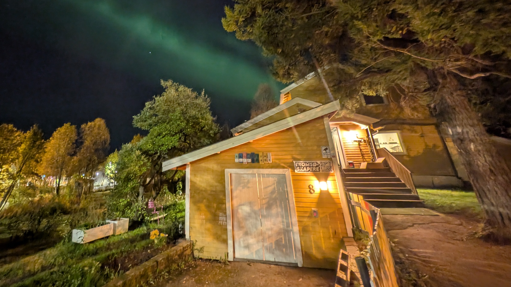

---
hide:
  - toc
---

# Velkommen til Skogstua!

Her finner du all infoen du trenger for å bruke huset og verkstedene våre på en trygg, smart og kreativ måte.

Enten du er helt ny, nysgjerrig, eller en erfaren bruker som må sjekke en manual – så skal du finne svaret her. Siden inneholder en oversikt over alle rom, maskiner og verktøy vi har.

### Slik finner du frem
- Bruk søkefeltet øverst for å finne noe raskt.
- Bruk menyen til venstre for å se hva som finnes. Alt er sortert etter etasjer, områder og rom.

>Siden er ny og under arbeid!
>Vi lanserte denne siden 28. oktober 2025, og jobber med å få alt på plass. Ser du en feil eller noe som mangler? Vi blir kjempeglade for bidrag! Ta en kikk på [GitHub-repoet](https://github.com/Tromsoskapere/mkdocs-skogstua) vårt for å se hvordan du kan hjelpe.

### ⚠️ VIKTIG: Sikkerhet først!
Du må lese sikkerhetsreglene for en maskin før du bruker den for første gang. Du finner de generelle reglene for hele huset på vår felles [Sikkerhetsside](sikkerhet.md).

