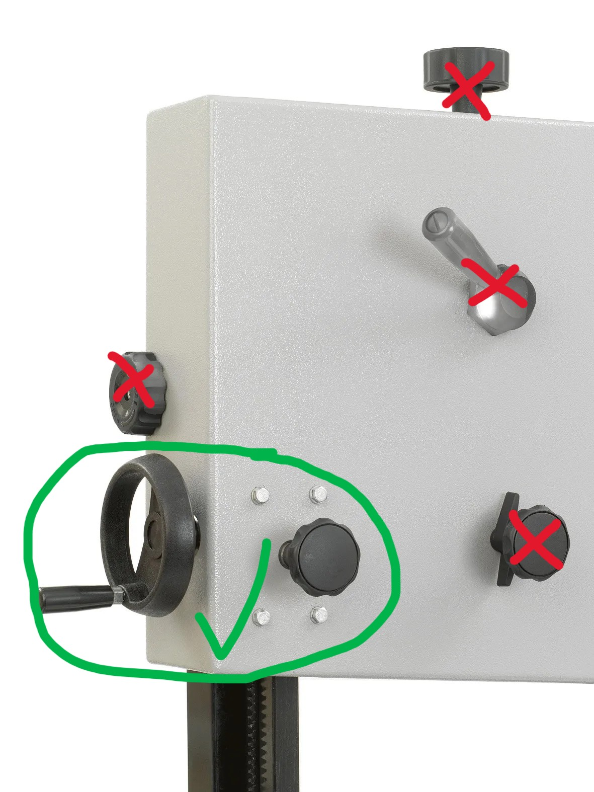

# Stor båndsag
En båndsag er et nyttig verktøy, men den er svært utsatt for feil bruk og selv de minste justeringer. Den er en følsom maskin, slik at det er viktig å bruke den med særlig aktelse. Den store båndsaga er primært ment for å kløyve stokker/trevirke. Detaljarbeid gjøres på den lille.
Rutiner for båndsaga:

- Ingen skarpe svinger! Bladet må ikke bøyes sidelengs
- Ikke dytt materialet for hardt - det sliter på bladet. Bladet må sage i "naturlig" fart. 
- Stramming og tilting/justering av blad og justeringer av støttene må klareres med styret
- De eneste hjulene og spakene som skal endres er disse:

Fra Verktøy AS:
[Record 350](https://verktoyas.no/produkter/maskiner/baandsager-tilbehoer/baandsager/record-baandsag-bs350-m-stativ)

[Bruksanvisning på norsk](RecordPowerBS350Norsk.pdf)
